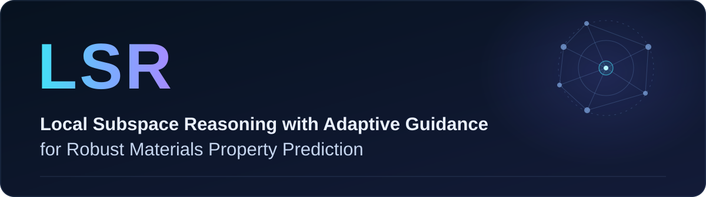
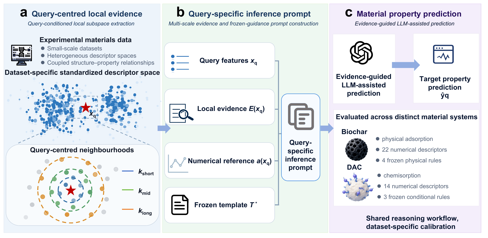

**Authors:** Yuanming Li, Shengyue Zhang, Chunfeng Li, Yihang Zhou, Shuai Deng, Shuangjun Li.

## Overview

LSR is a framework for materials property prediction using query-centred local evidence and scientific guidance. It combines measured neighbours, multi-scale statistics and an XGBoost reference with LLM-assisted reasoning.

The framework is evaluated on CO2 adsorption in Biochar and amine-functionalized direct-air-capture (DAC) adsorbents.

## Framework



The workflow consists of local evidence retrieval, query-specific prompt construction and evidence-guided property prediction.

## Highlights

- **Query-centred evidence:** retrieves relevant experimental observations from the local descriptor space.
- **Multi-scale context:** summarizes neighbouring observations at several scales.
- **Scientific guidance:** incorporates case-specific physical rules or training-side residual-guided corrections, frozen before test inference.

## Configuration

### Environment

Use Python 3.10 or later. Install from the repository root:

```bash
python -m pip install -e ".[live]"
```

### New data

1. Copy `configs/biochar.json` or `configs/dac.json` to a local file in the same directory, such as `configs/biochar_local.json`.
2. Update `name` and `data_path`. An absolute data path lets you keep the dataset outside the repository.
3. Preserve the required column names, units and categorical encodings. Review the split, neighbourhood and scientific-guidance settings for the new data.

The current workflows evaluate labelled CO2-uptake data, including `CO2_uptake`. The default DAC configuration additionally requires `split` (`train`/`test`) and a training-derived `xgb_pred` reference.

Check the configuration and dataset:

```bash
python -m lsr_co2 inspect-data --config configs/biochar_local.json
```

Other material systems or prediction targets require changes to dataset validation, prompt rendering and scientific guidance; editing JSON fields alone is insufficient.

### LLM

Configure your LLM API key locally before use. Never commit API keys or authentication files.

Experimental datasets, saved predictions and original run records are not included in this release.
